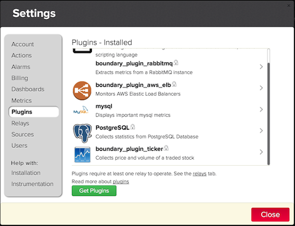

# Meter Plugin Manifest
The `plugin.json` file includes various pieces of metadata required by the meter plugin.

### Example Plugin Manifest

Below is a sample `plugin.json` that is an example plugin that can report on stock market price and volume. The complete meter plugin itself can be found [here](https://github.com/boundary/boundary-plugin-ticker)

```
{
  "description": "Collects price and volume of a traded stock",
  "icon": "ticker.png",
  "command": "python plugin.py",
  "ignore": "config",
  "metrics": [
    "BOUNDARY_STOCK_PRICE",
    "BOUNDARY_STOCK_VOLUME"
  ],
  "dashboards": [
    {
      "name": "Stocks",
      "layout": "d-w=1&d-h=2&d-pad=15&d-bg=none&d-g-BOUNDARY_STOCK_PRICE=0-0-1-1&d-g-BOUNDARY_STOCK_VOLUME=0-1-1-1"
    }
  ],
  "postExtract": "python post-extract.py",
  "paramArray": {
    "itemTitle": [
      "ticker"
    ],
    "schemaTitle": "Stock"
  },
  "paramSchema": [
    {
      "title": "Ticker",
      "name": "ticker",
      "description": "Stock ticker symbol",
      "type": "string",
      "default": "",
      "required": true
    }
  ]
}

```
### JSON Object Descriptions
A description of each of the JSON objects and their function follows.

#### `description`
Provides a brief summary of the meter plugin function. When a list of plugins is shown in the Boundary settings dialog the text of the description shows below the name of the plugin as shown here:



#### `icon`
A string with a relative path to an icon in the GitHub repository to be display in any view that lists plugins. Icon should be a 48x48 pixel in [Portable Network Graphics (PNG) format](http://en.wikipedia.org/wiki/Portable_Network_Graphics)

#### `command`
A string with a relative path to the command to run to get the metrics from the plugin.

#### `metrics`
A string array of the metric identifiers that are created when the plugin is installed. As part of the plugin guidelines these should always be in uppercase with words separated by underscores.

#### `dashboard`
An object array with a name and layout fields. The name field is a string represents the text that is displayed as the title for the dashboard. The layout field is a string that contains url obtained by editing the dashboard and then clicking on the clipboard icon, , which is then copied to your clipboard.

#### `postExtract`
A string with the relative path in the GitHub repository of a script or command that is executed by the plugin manager after the plugins files have been copied to the target system.

#### `paramArray`
An object array with a itemTitle and schemaTitle. The itemTitle is what is displayed to identify multiple configurations


paramSchema
An object array with the following:
title
name
description
type
default
required

Details on each of the fields follow.


title
The title is the label used to describe a plugin configuration. For plugins with multiple configurations it appears in the configuration dialog.
name
Unique string identifier that identifies a plugin configuration parameter. The name is used as the field in the param.json file which is discussed in Appendix B - Metric Plugin Runtime Configuration Reference.
description
Provides details about the plugin configuration parameter. In the configuration dialog the description appears as tooltip when the mouse is held over the input field.
type
Indicated the data type of the configuration field which can one of the following:
array
boolean
enum
password
string

{
            "title": "Protocol",
            "name": "protocol",
            "description": "The protocol of the endpoint",
            "type" : { "enum" : [["HTTP", "http"], ["HTTPS", "https"]]},
            "required": true
        },


{
            "title": "Virtual Hosts",
            "name": "virutalHosts",
            "description": "Include individual VHosts in your graphs",
            "type" : "array",
            "items" : {
                "type" : "string"
            }
        }


default

required

Appendix B - Metric Plugin Runtime Configuration Reference
This appendix documents the format of the runtime configuration provide to a plugin. At runtime the plugin manager (graphdat relay in the old school, and the 3.0 meter in the new school) provides a file, param.json with the configuration data provided by the user via the plugin configuration dialogs. The name, type, title, and mandatory fields are described by the
Metric Plugin Manifest as described in Appendix A - Metric Plugin Manifest Reference


Appendix C - Plugin Testing Score Sheet
This appendix is guide of testing tasks to ensure a quality experience with your metric plugin.

Deployed


