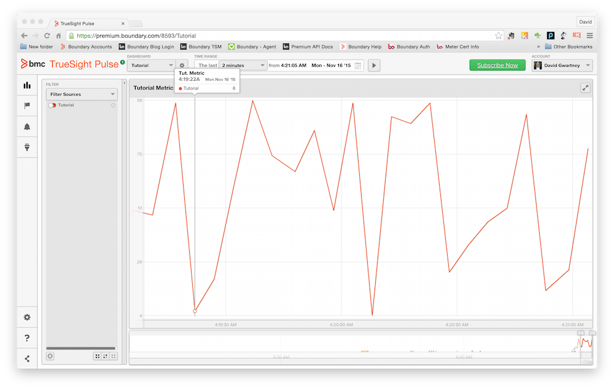

View Measurements
=================

Once the meter plugin has been deployed to the meter we can view the _Tutorial_ dashboard
to see our measurements output from the plugin.

## View the Tutorial Dashboard

1. From the _Dashboard_ drop-down menu select the _Tutorial_ dashboard.
2. Ensure that in the filter drop-down menu the _AVAILABLE SOURCES_ is checked.

## Tutorial Dashboard

